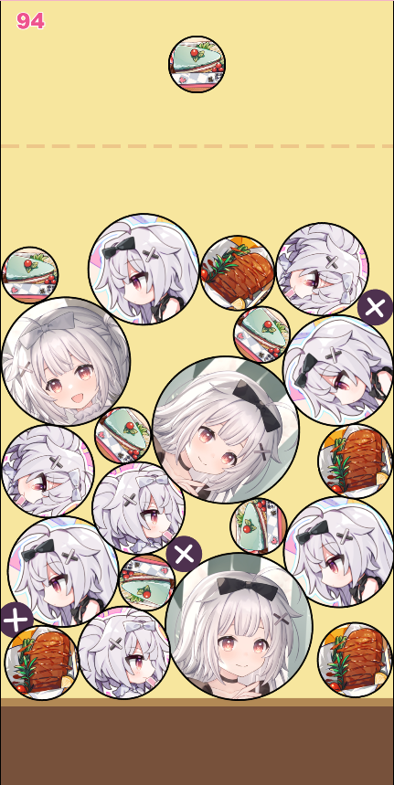

# 合成大西瓜 - 冬日树ver

- [《冬日树下的回忆》](https://store.steampowered.com/app/2403320/Memories_of_the_Winter_Tree/) 的二创游戏
- 用 [Phaser](https://phaser.io/) 复刻“合成大西瓜”的尝试

> **Q** 为什么开发这个游戏？
>
> **A** 原因有三：
>
> 1. 想做一个二创来表达对《冬日树下的回忆》的喜爱和对制作者的感谢，而作为程序员，想到通过编写代码来制作二创是理所当然的。
> 2. 《合成大西瓜》是一个有趣而不太复杂的小游戏，很适合作为练手项目，锻炼自己的编程能力。
> 3. ~~写代码使我快乐~~

## 在线试玩

- [官方链接](https://dan-kuroto.github.io/synthetic-winter-tree/)
  - 通过 `Github Actions` + `Github Pages` 部署，**始终为最新版本**
  - 由于 Github 服务器在国外，**访问速度较慢**（运气不好甚至可能打不开）
- [镜像链接](http://game.relievedmx.top/synthetic-winter-tree/)
  - 无法访问 Github 的情况下可以尝试访问这个链接
  - 第三方部署，更新可能延迟
  - **感谢 [夏梦summer_@bilibili](https://space.bilibili.com/3461569778288963) 部署的镜像**

## 技术栈

### 开发

参考：我的 `node.js` 版本是 `v18.20.3`，`npm` 版本是 `10.7.0`

- [Phaser 3.87.0](https://github.com/phaserjs/phaser)
- [React 18.2.0](https://github.com/facebook/react)
- [Vite 5.3.1](https://github.com/vitejs/vite)
- [TypeScript 5.2.2](https://github.com/microsoft/TypeScript)

## LICENSE

代码部分使用 [MIT](LICENSE) 协议。

游戏素材目录（`public/assets`）下，除 `ball-1.png`、`critical-text.png`、`ground.png`、`warning-line.png` 外，其余图片文件取自《冬日树下的回忆》游戏截图，音频文件取自《假面骑士Ex-Aid》，版权归原作者所有，仅供学习交流使用，禁止用于商业用途。
